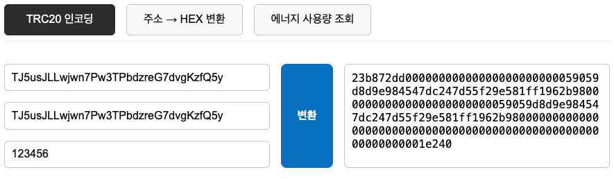
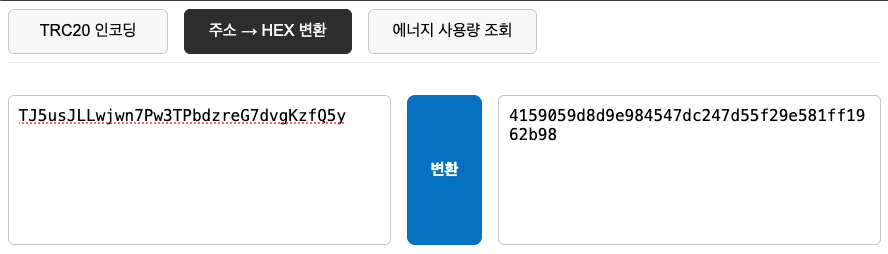

# 🛠️ TRON Tools — for Smart Contract Developers

TRON 개발자를 위한 VS Code 확장 도구입니다.  
TRC20 `transferFrom` ABI 인코딩, 주소 ➝ Hex 변환 등 스마트컨트랙트 테스트와 디버깅에 필요한 기능을 WebView UI로 제공합니다.

---

## ✨ 주요 기능

- 🔗 `transferFrom(owner, to, amount)` → ABI 인코딩 Hex 생성
- 🔄 TRON 주소(`T...`) → `0x41...` Hex 포맷 변환
- 📦 WebView 기반 직관적인 입력/출력 UI
- 🔜 향후 ABI 디코더, 서명 생성, RPC 유틸리티 추가 예정

---

## 🚀 사용 방법

### 1. 명령어 실행

1. VS Code에서 `Ctrl+Shift+P` (`Cmd+Shift+P` on Mac)
2. `> Open TRON Tools Panel` 명령 입력

### 2. UI에서 원하는 도구 선택

- 📤 **Transfer Encoder**
  - `owner`, `to`, `amount` 입력 → ABI 인코딩 Hex 출력
- 📥 **Address to Hex**
  - `T...` 형식의 주소 → `0x...` 포맷 변환

### 3. 결과 복사 후 테스트넷 / 백엔드에서 활용

---

## 📸 스크린샷

> Transfer Encoder  

>
> Address to Hex  

---

## 🧩 명령어

| Command ID         | 설명                      |
|--------------------|---------------------------|
| `tronTools.open`   | TRON Tools 패널 열기      |

---

## 🧱 향후 업데이트 예정

- 🧾 ABI 디코더 (`decodeFunctionData`)
- 🔐 Message Signing / Signature Verification
- 📡 Tron RPC 호출 유틸리티
- 🧪 계약 테스트 시나리오 구성 기능

---

## 📎 GitHub 레포지토리

[🔗 GitHub - tron-tools](https://github.com/minias/tron-tools)

Pull Request, Issue 모두 환영합니다 🙌

---

## 🔖 키워드

`tron`, `trc20`, `abi encoder`, `address hex`, `smart contract`, `transferFrom`, `blockchain`, `web3`, `vscode extension`

---

## ✅ 설치

[🛠️ VS Code 마켓플레이스에서 설치하기](https://marketplace.visualstudio.com/items?itemName=YOUR_PUBLISHER_NAME.tron-tools)
