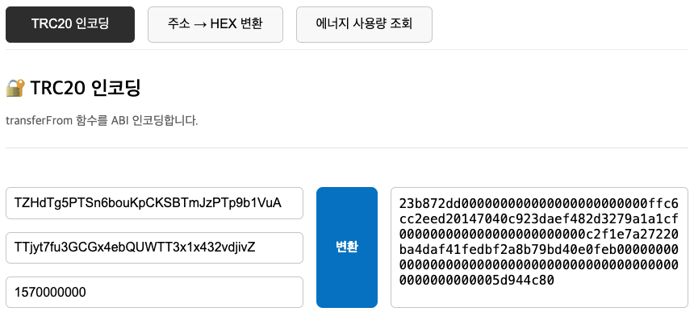
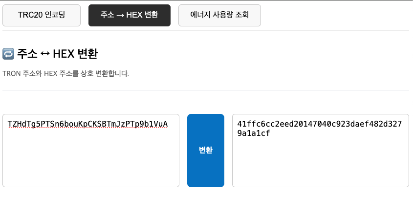

# 트론 툴즈 - 코인 개발자용

TRON 개발자를 위한 VS Code 확장 도구입니다.  
TRC20 `transferFrom` ABI 인코딩, 주소 ➝ Hex 변환 등 스마트컨트랙트 테스트와 디버깅에 필요한 기능을 WebView UI로 제공합니다.

---

## 스크린샷

> Transfer Encoder  

>
> Address to Hex  

>
> ResourceStatus

---

## 🚀 사용 방법

### 1. 명령어 실행 (단축키 `ctrl+shift+z`)

- 명령어창  `Ctrl+Shift+P` (`Cmd+Shift+P` on Mac) `> Open TRON Tools Panel` 명령 입력

---

## 향후 업데이트 예정

- 🧾 ABI 디코더 (`decodeFunctionData`)
- 🔐 Message Signing / Signature Verification
- 📡 Tron RPC 호출 유틸리티
- 🧪 계약 테스트 시나리오 구성 기능

---

## GitHub 레포지토리

[🔗 GitHub - tron-tools](https://github.com/minias/tron-tools)

Pull Request, Issue 모두 환영합니다 🙌

---

## 🔖 키워드

`tron`, `trc20`, `abi encoder`, `address hex`, `smart contract`, `transferFrom`, `blockchain`, `web3`, `vscode extension`,`minias`

---

## ✅ 설치

[🛠️ VS Code 마켓플레이스에서 설치하기](https://marketplace.visualstudio.com/items?itemName=YOUR_PUBLISHER_NAME.tron-tools)
